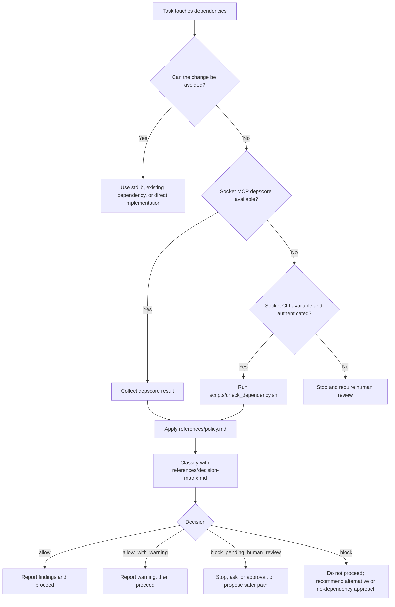

# Dependency Guard

Portable dependency-review guardrail for agentic coding workflows.

This repository now packages the same policy in multiple forms:

- `SKILL.md`: native Codex skill entrypoint
- `SKILL.md` with OpenClaw-compatible metadata: OpenClaw workspace/global skill entrypoint and ClawHub publish source
- `agents/openai.yaml`: Codex UI metadata
- `AGENTS.md`: project instructions for agents that auto-load `AGENTS.md`
- `CLAUDE.md`: Claude Code project memory
- `references/`: canonical policy, decision matrix, and reporting examples
- `scripts/check_dependency.sh`: helper that generates a Socket CLI review artifact
- `scripts/test.sh`: simple smoke-test runner for the repository helpers
- `examples/github/dependency-guard.yml`: copyable GitHub Actions example using `socket ci`

## Supported Agent Shapes

- Codex app: native skill via `SKILL.md`
- OpenClaw: native skill via `SKILL.md` in a `skills/` directory
- ClawHub: published OpenClaw skill bundle sourced from this repository
- Codex CLI: project instructions via `AGENTS.md`
- Claude Code: project memory via `CLAUDE.md`
- Other `AGENTS.md`-aware agents: use `AGENTS.md`

## Installation

Use the installer to vendor this bundle into a project or install it globally for a supported agent:

```sh
./scripts/install_skill.sh --mode project --agent all
./scripts/install_skill.sh --mode global --agent codex
./scripts/install_skill.sh --mode global --agent claude
./scripts/install_skill.sh --mode global --agent antigravity
./scripts/install_skill.sh --mode global --agent openclaw
./scripts/install_skill.sh --mode global --agent clawhub
```

Project mode:

- copies the bundle into `.agent-skills/dependency-guard` for Codex, Claude, and Antigravity
- copies the bundle into `skills/dependency-guard` for OpenClaw and ClawHub-oriented workspace installs
- updates project-root `AGENTS.md` for Codex-style and Antigravity-style project instructions
- updates project-root `CLAUDE.md` with an import for Claude Code

Global mode:

- Codex: installs into `$CODEX_HOME/skills/dependency-guard` or `~/.codex/skills/dependency-guard`
- Claude Code: installs into `~/.claude/skills/dependency-guard` and updates `~/.claude/CLAUDE.md`
- Antigravity: installs into `~/.gemini/skills/dependency-guard` and updates `~/.gemini/GEMINI.md`
- OpenClaw: installs into `~/.openclaw/skills/dependency-guard`
- ClawHub authoring: prepares the same bundle under `~/.openclaw/skills/dependency-guard` so it can be published or synced with `clawhub`

## How It Works

This bundle is designed so an agent can apply the same dependency-review policy regardless of whether it is running as a native skill, an `AGENTS.md`-driven project instruction, or a Claude memory import.



Use the skill when a task adds, upgrades, replaces, or risk-reviews a dependency, including transient package execution such as `npx` or `pnpm dlx`.

Before changing manifests or lockfiles, the agent must report:

- why the package is needed
- whether an alternative already exists
- what Socket reported
- whether install scripts, risky capabilities, or transitive risk are present

### Why There Are Multiple Files

- `SKILL.md` is the native skill entrypoint for Codex and OpenClaw, and the publish artifact ClawHub ingests.
- `AGENTS.md` is for tools that auto-load project instructions from that filename.
- `CLAUDE.md` is the Claude Code memory adapter.
- `references/` holds the canonical policy so the adapters stay short and consistent.
- `scripts/check_dependency.sh` gives non-MCP environments a repeatable fallback path.

### OpenClaw Notes

- OpenClaw loads workspace skills from `<workspace>/skills`.
- OpenClaw expects `metadata` in `SKILL.md` frontmatter to be a single-line JSON object.
- This repo keeps OpenClaw metadata in `SKILL.md` only; it does not require a separate memory import file.
- The skill declares `socket` in `requires.bins`; OpenClaw will filter the skill out if the Socket CLI is not installed.

### ClawHub Notes

- ClawHub is the public registry for OpenClaw skills and plugins.
- Native install/update flows can use `openclaw skills install <skill-slug>` and `openclaw skills update --all`.
- Registry-authenticated workflows such as publish and sync use the separate `clawhub` CLI.
- All ClawHub-published skills are public, so do not publish local secrets, private prompts, or environment-specific credentials in the skill bundle.
- The publish helper (`scripts/publish_clawhub.sh`) builds a **clean staging bundle** containing only OpenClaw-relevant files (SKILL.md, references/, check_dependency.sh, examples/, LICENSE). Agent-specific adapters (CLAUDE.md, AGENTS.md, agents/) and dev tooling are excluded from the published bundle.

### Install Models

- Project install: use when you want one repository to enforce this guardrail without changing the user’s global agent configuration.
- Global install: use when you want the same dependency policy available across many repositories for one agent.

## Local Setup

Install the Socket CLI:

```sh
npm install -g socket
```

Install the ClawHub CLI if you want to publish this skill bundle to the public registry:

```sh
npm install -g clawhub
```

### Local CLI Authentication

```sh
socket login
```

Recommended interactive setup:

1. Run `socket login`.
2. If your CLI offers a blank-token path, press Enter at the token prompt to use the limited public token.
3. Decline system-wide enforcement when prompted.
4. Decline bash completion when prompted.
5. If you already have a private Socket API token, paste that instead of using the limited public token.

Environment-variable alternative for headless or CI use:

```sh
export SOCKET_SECURITY_API_TOKEN="your-private-token"
```

> **Security:** Never paste private tokens into agent prompts. Use the env var or `socket login` instead.

### CI vs Local Credentials

| Context | Variable | Purpose |
|---------|----------|---------|
| Local CLI / headless | `SOCKET_SECURITY_API_TOKEN` | Authenticates the `socket` CLI for package reviews |
| GitHub Actions (`socket ci`) | `SOCKET_SECURITY_API_KEY` | Authenticates the Socket GitHub integration |

These are **different keys** issued through different Socket flows. See the CI example at `examples/github/dependency-guard.yml`.

Notes:

- Prefer MCP `depscore` when available; Socket's hosted MCP path can work without local CLI credentials.
- The blank-submit `socket login` flow is a CLI behavior that may provide limited public access, but Socket's public docs do not currently publish a quota number for that mode.
- The official Socket API rate limit documented for authenticated API usage is `600 requests per minute`.
- Authenticated tokens can query remaining quota with `GET /v0/quota`; the endpoint itself consumes `0` quota units.
- Do not enable `socket wrapper on` or shell completion by default in this bundle. Keep the CLI fallback opt-in and local to the user.

CLI review examples:

```sh
socket package shallow npm zod
socket package deep npm zod --markdown
```

## Manual Review Helper

Generate a review artifact before changing dependencies:

```sh
./scripts/check_dependency.sh npm zod
```

The helper writes a markdown report under `tmp/socket-reports/` by default. Apply `references/decision-matrix.md` to that report before changing manifests or lockfiles.

Run the bundled smoke tests:

```sh
./scripts/test.sh
```

## ClawHub Publish Helper

Publish a clean bundle to ClawHub. The `version` field in `SKILL.md` frontmatter is the single source of truth.

Auto-bump the version and publish:

```sh
./scripts/publish_clawhub.sh --bump patch --dry-run
./scripts/publish_clawhub.sh --bump minor --changelog "Add requires.bins metadata"
./scripts/publish_clawhub.sh --bump major --changelog "Breaking: require socket CLI"
```

Explicit version override (does not update SKILL.md):

```sh
./scripts/publish_clawhub.sh --version 2.0.0 --changelog "Manual version"
```

Read version from SKILL.md as-is:

```sh
./scripts/publish_clawhub.sh --dry-run
```

The helper builds a staging bundle containing only OpenClaw-relevant files, requires the `clawhub` CLI on `PATH`, and runs `clawhub publish`.

## CI Enforcement Example

This repo includes a disabled-by-default example workflow at `examples/github/dependency-guard.yml`.

To use it in another repository, copy it into `.github/workflows/dependency-guard.yml`.

The example workflow uses the same Node-based `socket` CLI as the local setup section.

The example workflow:

- runs on pushes and pull requests
- installs the Socket CLI
- runs `socket ci`
- fails when the scan violates policy

Required secret:

- `SOCKET_SECURITY_API_KEY`

## References

- [Safe npm FAQ](https://docs.socket.dev/docs/safe-npm-faq)
- [Socket Firewall Overview](https://docs.socket.dev/docs/socket-firewall-overview)
- [Guide to Socket MCP](https://docs.socket.dev/docs/guide-to-socket-mcp)
- [Socket for GitHub Actions](https://docs.socket.dev/docs/socket-for-github-actions)
- [Guide to Socket CLI](https://docs.socket.dev/docs/socket-cli)
- [socket package](https://docs.socket.dev/docs/socket-package)
- [OpenClaw Skills](https://docs.openclaw.ai/skills)
- [ClawHub](https://docs.openclaw.ai/tools/clawhub)
